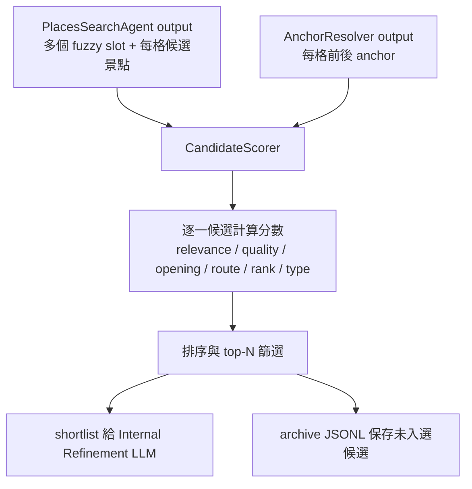

# CandidateScorer.py 中文 Code Review

檢查檔案：`/Users/xuchengyan/travel_agent/corporate_with_gemini/CandidateScorer.py`

## 一句話結論

`CandidateScorer.py` 目前是「可用的候選景點排序器」，但它還不是嚴謹的最佳化模型。它的設計比早期食物詞庫式 hard-coding 進步很多，因為不再假設只找美食，也會吃 `queries`、Google Places 類型、評分、營業時間、前後 anchor 距離。不過它仍有不少手調規則，例如固定權重、固定門檻、中文停用詞、文字式營業時間解析、直線距離代理分數。

所以我會把它定位成：

> 論文 prototype 的 heuristic scoring baseline，用來先把候選池縮小到 LLM 能處理的前兩名；之後可以透過 config、ablation study、人工標註資料或使用者回饋去調整權重。

## 目前主流程



它解決的是：不要把 Google Places 找到的一大堆候選全部丟給 LLM，而是先用程式縮成每個模糊 slot 的前兩名。

## Hard-Coding 檢查

### P1：營業時間判斷目前還是測試版

位置：`_opening_intervals()`、`_opening_score()`

問題是它讀的是 Google Places 回傳的 `weekdayDescriptions` 文字，例如：

```text
星期一: 10:00-18:00
星期二: 休息
```

目前程式把所有 weekday description 都掃過，收集所有時間區間，但沒有真的對應「行程那一天是星期幾」。所以如果星期一休息、星期六有開，星期一的行程可能還是被判成有營業。

你自己在 code 裡也有註解：「目前還沒有判斷星期一到星期日，只是整體的簡易判斷，所以不太對，只是 for 測試」。這個判斷正確。

長期做法：

- Planner 要輸出每個 day 的實際日期或 weekday。
- PlacesSearchAgent 要保留 Google Places structured opening periods，不只保留文字 description。
- CandidateScorer 用「該日期 + 該時段」去判斷是否覆蓋。

### P1：總分權重與門檻都是手調 heuristic

位置：`WEIGHTS`、`_opening_score()`、`_relevance_score()`、`_quality_score()`、`_route_score()`、`score_candidate()`

目前固定：

```python
WEIGHTS = {
    "relevance": 0.30,
    "quality": 0.21,
    "opening": 0.17,
    "route": 0.16,
    "google_rank": 0.08,
    "type": 0.08,
}
```

這不是錯，但這不是「數學證明出來的最佳權重」。它比較像你先用直覺建立一個 scoring policy。

例子：

如果候選 A 跟查詢很相關，但評分低、路線遠；候選 B 稍微沒那麼相關，但路線順、營業時間吻合，最後誰贏完全取決於這組權重。

論文要說服老師的方式不是硬說「這一定最好」，而是說：

- 這是根據旅遊排程需求設計的多準則評分函數。
- 每個構面都有明確意義。
- 之後用 ablation study 比較拿掉 route、拿掉 opening、改不同權重時，結果是否變差。
- 或者用人工標註的偏好資料去調權重。

### P1：現在沒有優先吃結構化 `start_time` / `end_time`

位置：`score_candidate()` 呼叫 `_opening_score(candidate, slot.get("time"))`

我們前面已經讓 Planner / Extractor 輸出 `start_time`、`end_time`，但 CandidateScorer 現在營業時間判斷還是吃舊的 `time` 字串，例如 `"11:00~13:00"`。

這會讓 `_parse_slot_time()` 還需要猜字串格式。

比較長期的做法：

```json
{
  "start_time": "11:00",
  "end_time": "13:00",
  "time": "11:00~13:00"
}
```

程式應該先用 `start_time` / `end_time`，只有缺資料時才 fallback 到 `time`。

### P2：中文停用詞與切詞仍是 heuristic

位置：`LOW_INFORMATION_TERMS`、`_split_terms()`、`_clean_term()`

這裡已經比原本的 FOOD_TERMS 好，因為它不是把「牛肉湯、豆花、蝦捲」寫死，而是只移除比較無資訊量的詞，例如「推薦、資訊、時間、活動」。

但它還是 hard-coded：

- 只對中文與簡單英文規則有效。
- 不懂語意，只是字串切割。
- 「深度旅遊」「在地文化」「老屋咖啡」這種詞可能切得不夠細。

長期可以讓 Search Topic Generator 額外輸出：

```json
{
  "target_terms": ["老屋", "咖啡"],
  "location_terms": ["台南", "中西區"],
  "intent_type": "cafe",
  "must_have": ["可停留 1.5 小時"]
}
```

這樣 Scorer 就不用自己猜哪些字重要。

### P2：語意相關度不是 embedding，也不是 LLM judge

位置：`_term_match_score()`、`_relevance_score()`

目前相關度靠：

- 字串是否包含。
- 中文字元重疊。
- 英文 token 重疊。

例子：

「台南文學」遇到「台灣文學館」可能會得不錯，這是好的。

但「藝術文化」遇到「文化路停車場」也可能因為「文化」兩字而拿到一些分數，這就是字串方法的限制。

長期可以做兩條路：

- 輕量版：讓 LLM 在 Search Topic Generator 階段輸出更乾淨的 structured intent。
- 進階版：用 embedding similarity 或小型 LLM reranker 判斷候選是否符合 slot。

### P2：距離分數是直線距離，不是真實交通時間

位置：`_route_score()`、`_haversine_km()`

現在用 Haversine 算兩點直線距離，這很便宜、很快、不需要額外 API。

但旅遊排程真正需要的是：

- 開車時間。
- 步行時間。
- 大眾運輸時間。
- 當地道路與河流、橋樑、塞車狀態。

例如直線距離 2 km，不代表真的 5 分鐘能到。

目前可以接受，因為我們只是先把明顯很遠的候選扣分。但文件或論文裡要誠實稱為 `straight_line_distance_proxy`，程式也已經這樣命名，這點是好的。

### P2：缺資料時給中立分數，可能太寬鬆

位置：`_opening_score()`、`_quality_score()`、`_route_score()`、`_type_score()`

例子：

- 缺營業時間：`0.55`
- 缺 Google 評分：`0.55`
- 缺 anchor：`0.55`
- 沒有 intent：type score `0.72`

這樣做的好處是不會因為 Google 沒給資料就直接殺掉候選。

風險是：資料越少的候選，反而可能沒有被扣太多。

長期可以區分：

- `unknown`：未知，不扣太重。
- `bad`：明確不符合，扣很重。
- `missing_critical`：某些 slot 必須知道，例如餐廳營業時間，缺資料就不能太高。

### P2：top-N selection 有 diversity bonus，但也是手調

位置：`_select_for_llm()`

目前第二名不一定只看總分，還會看是否覆蓋不同關鍵詞。

例如「豆花、蝦捲」這個 slot，如果第一名是豆花，第二名可能偏向蝦捲，而不是另一間豆花。

這個設計是合理的，因為你要給 LLM 多一點替換彈性。但 `0.16`、`0.24` 這些數字仍然是手調。

### P3：pipeline 檔名編號有點混亂

原本 `AnchorResolver` 與 `CandidateScorer` 都使用 `04_*` 檔名，學習地圖和論文圖會比較混亂。現在建議改成依實際執行順序編號。

建議長期改成：

- `03_anchor_context_output.json`
- `05_candidate_score_output.json`
- `05_candidate_shortlist_for_refinement.json`

## 逐段導讀

下面用接近逐行的方式說明。因為整支檔案有 999 行，我用「行號區間 + 例子」解釋；重複性的 dict 欄位不逐欄硬唸，會集中說它們代表什麼。

### Lines 1-9：imports

```python
import argparse
from datetime import datetime
import json
import math
import os
from pathlib import Path
import re
import sys
from typing import Any, Dict, Iterable, List, Optional, Tuple
```

- `argparse`：讓這支程式可以從 terminal 接收參數，例如 input 路徑、top-n、output-dir。
- `datetime`：寫 archive 時記錄何時封存。
- `json`：讀寫 `.json` 與 `.jsonl`。
- `math`：用在距離公式、指數函數、ceil。
- `os`：讀環境變數，例如距離扣分尺度。
- `Path`：處理檔案路徑。
- `re`：用正規表示式切時間、切文字。
- `sys`：沒有傳 input path 時從 stdin 讀 JSON。
- `typing`：型別標註，讓你知道每個 function 預期吃什麼、回傳什麼。

### Lines 12-14：預設輸出與簡易資料庫位置

```python
DEFAULT_TOP_N = 2
STORE_DIR = Path(__file__).resolve().parent / "candidate_store"
DEFAULT_ARCHIVE_PATH = STORE_DIR / "candidate_archive.jsonl"
```

- `DEFAULT_TOP_N = 2`：每個模糊 slot 預設只送前兩名給 LLM。
- `STORE_DIR`：候選池封存的位置。
- `DEFAULT_ARCHIVE_PATH`：全域候選 archive，現在用 JSONL 先代替資料庫。

例子：如果「台南特色小吃」找到 20 個候選，只會挑 2 個進下一階段，另外 18 個寫入 archive。

### Lines 16-43：低資訊詞

```python
LOW_INFORMATION_TERMS = {...}
```

這是 Scorer 用來忽略的詞，例如「推薦」「營業」「時間」「資訊」。

例子：

```text
台南 國華街 牛肉湯 營業時間
```

程式希望「營業」「時間」不要變成主要相關度依據，真正有用的是「國華街」「牛肉湯」。

這裡仍然有 hard-coding，但比 FOOD_TERMS 好很多，因為它不是枚舉所有可能的食物或景點。

### Line 45：泛用 intent

```python
GENERIC_INTENTS = {"", "poi", "place", "places_search", "search", "unknown"}
```

如果 query generator 給的 intent 太泛，例如 `place`、`unknown`，Scorer 會忽略它，不拿來做 type score。

例子：

- `intent = "restaurant"`：有用。
- `intent = "place"`：太泛，不用。

### Lines 48-52：讀環境變數 float

```python
def _env_float(name: str, default: float) -> float:
```

這個 function 嘗試從 `.env` 或 shell 環境讀一個浮點數。

例子：

```bash
CANDIDATE_ROUTE_DETOUR_SCALE_KM=2.0
```

如果有設，就用 2.0；如果沒設或格式錯，就用 default。

### Lines 55-66：總分權重與距離參數

```python
WEIGHTS = {...}
EARTH_RADIUS_KM = 6371.0088
ROUTE_DETOUR_SCALE_KM = ...
```

- `WEIGHTS`：六個構面怎麼加權。
- `EARTH_RADIUS_KM`：地球半徑，用於 Haversine 直線距離。
- `ROUTE_DETOUR_SCALE_KM`：繞路幾公里開始明顯扣分。
- `ROUTE_LEG_SCALE_KM`：單段距離幾公里開始明顯扣分。
- `ROUTE_FAR_LEG_WARNING_KM`：超過幾公里就給 warning。

例子：如果候選點讓路線多繞 3 km，`detour_score = 1 / (1 + 3 / 3) = 0.5`。

### Lines 69-70：把分數限制在 0 到 1

```python
def _clamp(value, low=0.0, high=1.0):
    return max(low, min(high, value))
```

避免分數超過範圍。

例子：

- `_clamp(1.2)` 變 `1.0`
- `_clamp(-0.3)` 變 `0.0`

### Lines 73-80：讀 input JSON

```python
def _read_json_from_path_or_stdin(path):
```

如果 CLI 有傳檔案路徑，就讀檔；沒有就從 stdin 讀。

例子：

```bash
python CandidateScorer.py 04_places_search_agent_output.json
```

或：

```bash
cat 04_places_search_agent_output.json | python CandidateScorer.py
```

### Lines 83-119：時間解析

`_time_to_minutes()` 把 `"11:30"` 轉成分鐘數。

例子：

```text
11:30 -> 11 * 60 + 30 = 690
```

`_parse_slot_time()` 把 `"11:00~13:00"` 轉成 `(660, 780)`。

`_parse_opening_interval()` 把營業時間片段 `"10:00-18:00"` 轉成 `(600, 1080)`。

如果結束時間小於開始時間，程式認為它跨日。

例子：

```text
22:00-02:00 -> 22:00 到隔天 02:00
```

hard-coding 風險：它假設時間會長得像 `HH:MM~HH:MM`，所以未來應該優先使用 `start_time` / `end_time` 結構欄位。

### Lines 122-143：從 Google Places 文字營業時間抽區間

`_opening_intervals(place)` 會從候選地點裡找：

```python
regular_opening_hours.weekdayDescriptions
current_opening_hours.weekdayDescriptions
```

然後把每一天的文字描述切成營業時間。

例子：

```text
星期一: 10:00-18:00
```

會抽出 `(600, 1080)`。

如果文字包含 `24 小時` 或 `24 hours`，就當成整天營業。

如果包含 `休息` 或 `closed`，就跳過。

問題：它目前沒有根據實際日期選星期幾，所以這段只能算 prototype。

### Lines 146-177：營業時間分數

`_interval_overlap()` 算兩個時間區間重疊幾分鐘。

例子：

```text
行程 11:00-13:00
營業 10:00-12:00
重疊 60 分鐘
coverage = 60 / 120 = 0.5
```

`_opening_score()` 規則：

- coverage >= 0.9：給 `1.0`
- coverage >= 0.45：給 `0.55`
- 否則：給 `0.08`
- 無法解析或缺資料：給 `0.55`

這些門檻都是手調 heuristic。

### Lines 180-236：文字正規化與切詞

`_normalize_text()`：

- 轉字串。
- 小寫。
- 把「臺」換成「台」。

例子：

```text
臺南 -> 台南
```

`_slot_key()`：

- 如果有 `slot_id`，優先用 `slot_id:xxx`。
- 沒有 `slot_id`，才用 day/time/activity 組合。

這跟我們前面加入 `slot_id` 的方向一致。

`_clean_term()`：

- 去掉標點。
- 去掉後綴，例如「推薦」「資訊」「營業時間」「附近」「周邊」。
- 去掉最後的「等」。

例子：

```text
牛肉湯推薦 -> 牛肉湯
安平老街附近 -> 安平老街
```

`_is_cjk()` 判斷是否有中文字。

`_split_terms()` 把一段文字拆成詞，並移除低資訊詞與重複詞。

例子：

```text
台南 國華街 牛肉湯 營業時間
```

可能變成：

```json
["台南", "國華街", "牛肉湯"]
```

### Lines 239-300：建立 slot profile

`_query_terms(slot)` 從一個模糊 slot 的多組 query 裡抽詞。

例子：

```json
[
  {"query": "台南 國華街 牛肉湯"},
  {"query": "台南 國華街 虱目魚肚"}
]
```

會變成：

```json
[
  ["台南", "國華街", "牛肉湯"],
  ["台南", "國華街", "虱目魚肚"]
]
```

`_query_intents(slot)` 抽 query 的 intent，例如 `restaurant`、`museum`。

`_slot_profile(slot)` 把 slot 拆成：

- `query_groups`：每組 query 的詞。
- `original_terms`：原始活動文字的詞。
- `context_terms`：多個 query 重複出現的背景詞，例如「台南」「國華街」。
- `priority_terms`：真正要找的東西，例如「牛肉湯」「虱目魚肚」。
- `query_intents`：查詢意圖。

hard-coding 點：`context_threshold = max(2, ceil(query_count * 0.6))` 是手調門檻。

### Lines 303-403：相關度分數

`_term_match_score(term, haystack)` 判斷某個詞跟候選文字有多像。

規則：

- 如果 term 直接出現在 haystack：`1.0`
- 如果是中文字，算字元重疊比例。
- 如果是英文，算 token 重疊比例。

例子：

```text
term = 牛肉湯
haystack = 國華牛肉湯 restaurant
score = 1.0
```

`_matched_terms()` 回傳命中的詞。

`_candidate_text()` 把候選地點的 name、address、type、matched query 合成一段文字。

`_candidate_semantic_text()` 只拿 name/type，避免地址中的字誤導語意。

`_candidate_location_text()` 只拿地址。

`_score_terms()` 對多個詞算平均分，只取前幾個最有用的分數。

`_relevance_score()` 是整個相關度核心：

```python
base = (
    0.50 * priority_semantic_score
    + 0.14 * priority_location_score
    + 0.14 * context_score
    + 0.14 * original_score
    + 0.08 * query_hint_score
)
```

再加上 `query_bonus`，如果一個候選是由多個 query 命中的，就稍微加分。

重要保護：

```python
if priority_terms and not semantic_priority_matches:
    score = min(score, 0.28)
```

意思是：如果候選名稱/type 完全沒命中主要詞，不准靠地址或 query hint 拿太高分。

例子：搜尋「牛肉湯」，某候選地址在國華街，但店名跟類型完全看不出牛肉湯，相關度最多只能到 0.28。

### Lines 406-428：品質分數

`_quality_score(candidate)` 使用：

- Google rating
- user rating count

規則：

```python
rating_component = rating / 5
review_confidence = 1 - exp(-review_count / 1000)
quality = rating_component * review_confidence
```

例子：

如果評分 4.6、評論數 534：

```text
rating_component = 4.6 / 5 = 0.92
review_confidence = 1 - exp(-0.534) 約 0.414
quality 約 0.381
```

這就是你看到 `國華牛肉湯 quality = 0.3806` 的原因。

評論數越多，可信度越高；但不是線性暴衝，而是慢慢接近 1。

hard-coding 點：

- 評分低於 4.0 warning。
- 評論數低於 100 warning。
- 1000 是 review confidence 的尺度。

### Lines 431-454：類型分數與 Google rank

`_type_score()` 會拿 query intent 跟 Google Places type 比對。

例子：

- query intent 是 `restaurant`
- candidate type 有 `taiwanese_restaurant`
- 會得到較高 type score。

如果沒有 intent，直接給 `0.72`，代表「不知道，不強扣」。

`_google_rank_score()` 讀的是 PlacesSearchAgent 之前放進候選的 `ranking_signals.google_rank_score`。

例子：

搜尋結果第一名可能是 `1.0`，後面逐步變低。

### Lines 457-593：距離與 route 分數

`_coordinates()` 從候選或 anchor 裡取座標。

支援兩種格式：

```json
{"latitude": 22.99, "longitude": 120.20}
```

或：

```json
{"location": {"latitude": 22.99, "longitude": 120.20}}
```

`_haversine_km()` 用地球半徑計算兩點直線距離。

`_anchor_place()` 從 anchor 裡取出 `place`。

`_compact_anchor()` 把 anchor 縮成比較乾淨的格式，方便輸出給 debug / LLM。

`_route_score(candidate, slot_anchor_context)` 是距離評分核心。

它會算：

- previous anchor 到 candidate 的距離。
- candidate 到 next anchor 的距離。
- previous anchor 到 next anchor 原本的距離。
- 加入 candidate 後多繞多少路。

例子：

```text
上一站 -> 下一站原本直線 2 km
上一站 -> 候選 1 km
候選 -> 下一站 1.5 km
route_distance = 2.5 km
detour = 2.5 - 2 = 0.5 km
```

如果有前後 anchor：

```python
score = 0.70 * detour_score + 0.30 * leg_score
```

如果只有一邊 anchor，就只看單段距離。

這裡合理，但它是直線距離代理，不是真正交通時間。

### Lines 596-624：狀態懲罰與原因文字

`_status_penalty()` 看 `business_status`。

- `OPERATIONAL`：不扣分。
- 其他狀態：扣 `0.4`。

例子：如果 Google 顯示 `CLOSED_TEMPORARILY`，就會被重扣。

`_reason_text()` 生成比較人類可讀的原因。

例子：

```text
符合「牛肉湯」；Google 評分 4.6，534 則評論；由查詢「台南 國華街 牛肉湯」命中；前後站直線路徑約 1.643 km
```

這個欄位很好，因為之後你給老師 demo 時可以解釋「為什麼它選這個」。

### Lines 627-691：單一候選總分

`score_candidate(slot, candidate, slot_anchor_context)` 是最核心的 function。

它依序算：

- `relevance`
- `quality`
- `opening`
- `type_score`
- `google_rank`
- `route`
- `penalty`

然後依權重加總：

```python
weighted = (
    0.30 * relevance
    + 0.21 * quality
    + 0.17 * opening
    + 0.16 * route
    + 0.08 * google_rank
    + 0.08 * type_score
)
```

接著有一個 `relevance_gate`：

```python
relevance_gate = 0.55 + 0.45 * relevance
total_score = (weighted - penalty) * relevance_gate
```

這代表即使一個候選品質、距離、營業時間都不錯，只要跟 slot 不相關，總分仍然會被壓低。

真實例子：

```json
{
  "name": "國華牛肉湯",
  "scores": {
    "total": 0.502,
    "relevance": 0.5002,
    "quality": 0.3806,
    "opening": 1.0,
    "route": 0.7982,
    "google_rank": 0.5,
    "type": 1.0,
    "penalty": 0.0,
    "relevance_gate": 0.7751
  }
}
```

你可以這樣讀：

- 它確實符合牛肉湯，所以 relevance 中等偏上。
- 評分高但評論數不是爆大量，所以 quality 只有 0.38。
- 營業時間吻合，opening 1.0。
- 前後站距離順，route 0.7982。
- 最後總分 0.502。

### Lines 694-750：壓縮候選與 top-N 選擇

`_compact_candidate()` 把完整候選縮成 LLM 需要看的欄位。

保留：

- 名稱。
- 地址。
- 座標。
- Google Maps 連結。
- 分數 breakdown。
- route meta。
- warnings。
- why。

`_candidate_priority_terms()` 看候選命中了 slot 的哪些主要詞。

`_select_for_llm()` 選 top-N，但不是只看總分，還加入 diversity bonus。

例子：

slot 是：

```text
安平老街午餐（豆花、蝦捲等）
```

如果第一名已經是「同記安平豆花」，第二名就可能選「周氏蝦捲」而不是另一家豆花，因為這樣更能覆蓋「豆花、蝦捲」兩種可能。

真實輸出：

```json
[
  {"name": "同記安平豆花（安平2店）", "score": 0.5803},
  {"name": "周氏蝦捲 老店", "score": 0.5546}
]
```

這個設計符合「保留 LLM 創意，但不要給太多 token」的目標。

### Lines 753-884：多個 slot 一起評分

`_anchor_context_by_slot()` 把 AnchorResolver 的結果整理成 map。

優先用 `slot_id`，沒有才退回 day/time/activity。

`score_candidate_slots()` 做整批流程：

1. 讀 `places_result["candidate_slots"]`。
2. 找到該 slot 對應的 anchor context。
3. 對每個 candidate 呼叫 `score_candidate()`。
4. 依 `eligible_for_llm` 與總分排序。
5. 選 top-N。
6. 沒選上的放到 `archived_records`。
7. 同時產生完整 debug output 與 LLM input。

最後回傳：

- `slots`：完整結果，含所有候選與完整分數。
- `llm_input`：只放 top candidates，給下一個 LLM。
- `archived_records`：未入選候選，之後可當簡易候選資料庫。

這正好符合你說的：「前兩名送給 LLM，其他先留在資料庫替代方案」。

### Lines 887-954：archive 與輸出檔案

`_archive_key()` 產生去重 key。

例子：

```text
run_id|slot_id|day|time|original_activity|place_id
```

`write_jsonl()` 每次寫本次 run 的 archive。

`append_jsonl()` 追加到全域 archive，並避免重複寫入。

`save_scoring_outputs()` 寫三個檔案：

- `05_candidate_score_output.json`：完整分數，debug 用。
- `05_candidate_shortlist_for_refinement.json`：下一階段 LLM input。
- `05_candidate_archive.jsonl`：本次沒入選的候選。

同時也會追加到：

- `candidate_store/candidate_archive.jsonl`

這就是現在「沒有正式資料庫」的替代做法。

### Lines 957-999：CLI 入口

`main()` 讓你可以用 terminal 單獨跑 CandidateScorer。

常用形式：

```bash
.venv/bin/python corporate_with_gemini/CandidateScorer.py \
  corporate_with_gemini/run_outputs/20260706_013645/04_places_search_agent_output.json \
  --anchor-context corporate_with_gemini/run_outputs/20260706_013645/03_anchor_context_output.json \
  --output-dir corporate_with_gemini/run_outputs/20260706_013645
```

流程：

1. 建立 CLI parser。
2. 讀 input Places result。
3. 如果沒傳 run-id，就用 input 檔案的資料夾名稱。
4. 如果有 `--anchor-context`，讀 AnchorResolver 輸出。
5. 呼叫 `score_candidate_slots()`。
6. 如果有 output-dir，寫檔並印出檔案路徑。
7. 如果沒有 output-dir，只印出 LLM shortlist。

## 我建議下一輪修改

如果你要我下一步直接改 code，我會優先改這幾個，不會一次大爆改：

1. 讓 `_opening_score()` 優先吃 `start_time` / `end_time`，再 fallback 到 `time`。
2. 把 `WEIGHTS`、門檻、neutral score 抽成 config，避免散在 code 裡。
3. 把輸出檔名改成 step 05，讓 pipeline 編號清楚。
4. 在 `Search Topic Generator` 輸出 `target_terms`、`location_terms`、`intent_type`，讓 Scorer 少猜文字。
5. 長期再改營業時間 weekday 判斷，這需要 Planner 有日期或 weekday。

## 對論文的說法

你可以這樣描述它：

> 本研究在候選景點搜尋後加入一個多準則候選評分器，目的不是完全取代 LLM 的旅遊規劃能力，而是降低 LLM 在大量候選資訊中的選擇負擔。評分器綜合語意相關性、地點品質、營業時間、路線順暢度、搜尋排名與地點類型等構面，先將候選池縮小為少量高可信候選，再交由 LLM 進行內部 refinement。此方法保留 LLM 的彈性，同時透過可解釋分數減少幻覺與 token 成本。

目前它還不是最終學術貢獻本身，但它可以成為你後續「人機共編 + iterative refinement」裡面很重要的候選治理模組。
