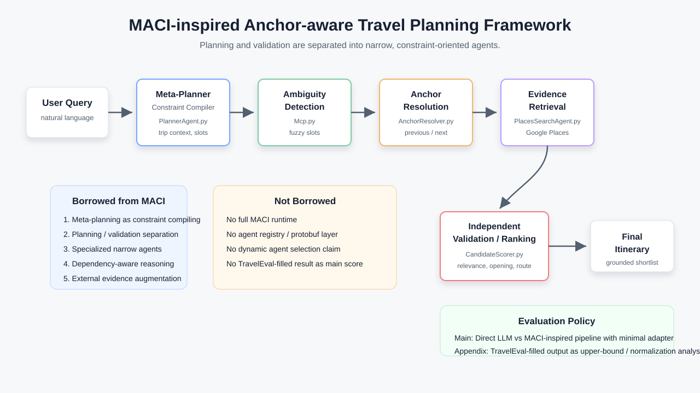
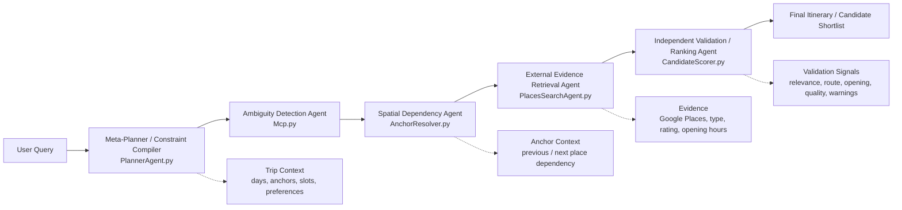

# MACI-inspired Anchor-aware Travel Planning Framework

> 本文件是論文與口試用的研究整理包。它不要求修改核心程式，也不宣稱完整實作 MACI；重點是說清楚本研究借用 MACI 的哪些設計思想，以及這些思想如何對應到目前 `corporate_with_gemini` 的 pipeline。

## 1. 方法名稱與研究主張

建議英文名稱：

> **MACI-inspired Anchor-aware Travel Planning Framework**

建議中文名稱：

> **受 MACI 啟發的錨點感知旅遊規劃框架**

核心主張：

> 本研究借用 MACI 的規劃驗證分離與多代理責任切分思想，將旅遊規劃拆解為初始規劃、模糊活動偵測、空間依賴解析、外部地點證據檢索與候選驗證排序，以降低單一 LLM 在旅遊規劃中常見的地點幻覺、約束漂移與路線不合理問題。

這裡的重點不是複製 MACI runtime，而是抽取它最適合旅遊規劃的三個概念：

- **Constraint-oriented decomposition**：先把任務拆成地點、時間、活動、偏好、交通依賴。
- **Planning / validation separation**：不要讓同一個 LLM 同時規劃並相信自己的答案。
- **Specialized agents with narrow responsibility**：每個模組只處理一種限制或證據來源。

參考來源：

- MACI paper: [MACI: Multi-Agent Collaborative Intelligence for Adaptive Reasoning and Temporal Planning](https://ar5iv.org/html/2501.16689v2)
- TravelEval repo: `/private/tmp/TravelEval/README.md`

## 2. 系統架構圖

SVG 版本可放到投影片：

Mermaid 版本可放入論文草稿或 Markdown：

## 3. MACI 借用範圍對應表

| MACI 概念 | 本研究如何借用 | 對應模組 | 解決的旅遊規劃問題 |
| --- | --- | --- | --- |
| Meta-Planner | 不把 planner 視為最終答案產生器，而是視為 trip context 與 slot schema 的 constraint compiler。 | `PlannerAgent.py` | 單一 LLM 容易直接產生看似完整但缺少 grounding 的行程。 |
| Planning / Validation Separation | 初始行程由 planner 產生；地點真實性、空間合理性、候選品質由後續模組獨立檢查。 | 全 pipeline | 降低 LLM 自我驗證失敗與 constraint drift。 |
| Specialized Agents | 每個模組只處理一個子問題，不做完整 agent registry。 | `Mcp.py`, `AnchorResolver.py`, `PlacesSearchAgent.py`, `CandidateScorer.py` | 避免單一 prompt 同時處理搜尋、地理、營業時間、評分與格式。 |
| Dependency Graph Thinking | 以 slot 前後 anchor 表示 spatial dependency，候選點不能只看文字相關，也要看前後行程位置。 | `AnchorResolver.py` | 避免把遠離路線的餐廳或景點插入行程。 |
| Common-sense / Evidence Augmentation | 用 Google Places、營業時間、rating、地點類型、距離 proxy 補足 LLM 常識不足。 | `PlacesSearchAgent.py`, `CandidateScorer.py` | 降低 POI 幻覺、營業時間錯誤與地點類型不符。 |
| Runtime Monitor | 不做真正即時 runtime，而是用 scoring warnings / validation report 當作修正提示。 | `CandidateScorer.py` + evaluation harness | 把「可能不合理」顯性化，供後續 refinement 或人工檢查。 |

## 4. 模組定位

### `PlannerAgent.py`: Meta-Planner / Constraint Compiler

負責將使用者自然語言轉成初始規劃狀態：

- `trip_context`: origin, destination, country/region, language, arrival/return anchor。
- `itinerary`: 每日時間軸。
- `slot_id`: 穩定追蹤每個活動格。
- `is_searchable`: 標記需要外部 grounding 的模糊活動。
- `place_query`, `route_entry_place`, `route_exit_place`: 明確地點或 route anchor。

論文中不要說它已經完成所有規劃，而要說它產生「可被後續 agent 驗證與補強的初始 plan representation」。

### `Mcp.py`: Ambiguity Detection Agent

負責找出初始行程中的模糊 slot，例如：

- 「享用午餐」
- 「花蓮市區美食」
- 「賞鯨活動」
- 「特色小吃」

它同時輸出 structured intent：

- `target_terms`
- `location_terms`
- `intent_type`
- `must_have`

這些欄位讓後續搜尋與評分不只靠 activity 字串猜測。

### `AnchorResolver.py`: Spatial Dependency Agent

負責把每個模糊 slot 放回行程脈絡中：

- previous anchor: 模糊活動前一個明確地點。
- next anchor: 模糊活動後一個明確地點。
- default start/end anchor: 找不到前後站時的 fallback。

這是本研究最適合對應 MACI dependency graph 的地方。旅遊活動不是獨立節點，而是受前後位置、交通時間與當日時段限制。

### `PlacesSearchAgent.py`: External Evidence Retrieval Agent

負責將模糊 slot 轉成 Google Places query，並回收候選池：

- place id / name / address / coordinates。
- primary type / types。
- Google Maps URI。
- optional rating, user rating count, opening hours。

這一層的研究意義是：LLM 不直接發明地點，而是先提出需求，再由外部資料源提供可查證候選。

### `CandidateScorer.py`: Independent Validation / Ranking Agent

負責獨立評估候選，而不是讓 planner 自己選：

- relevance score: 是否符合 slot 意圖。
- quality score: rating 與評論量。
- opening score: 是否符合時段。
- route score: 是否接近前後 anchor。
- type score: Google type 是否符合意圖。
- warnings: 顯示營業、距離、類型或狀態問題。

這是 MACI 的 planning / validation separation 在本系統中的主要落點。

## 5. 案例 Walkthrough

以下使用既有 run output：

- Run: `corporate_with_gemini/run_outputs/20260706_181335`
- User query: 「我想要八月的時候去花蓮三天兩夜，我沒怎麼去過東台灣，想體驗一下跟西台灣不同的風景樣貌，看看太魯閣的壯闊，也想體驗當地美食」

### Step 1: Meta-Planner 產生初始時間軸

`PlannerAgent.py` 產生花蓮三天兩夜行程，並在 Day 1 中放入：

| slot | time | activity | searchable |
| --- | --- | --- | --- |
| `day1_slot02` | 10:00-12:00 | 參觀太魯閣砂卡礑步道 | false |
| `day1_slot04` | 12:30-13:30 | 享用午餐 | true |
| `day1_slot06` | 14:00-16:00 | 參觀清水斷崖 | false |

研究解讀：planner 沒有硬編一間餐廳，而是承認「午餐」需要 grounding。

### Step 2: Ambiguity Detection 找出模糊 slot

`Mcp.py` 將 `day1_slot04` 解析為：

| 欄位 | 值 |
| --- | --- |
| `original_activity` | 享用午餐 |
| `intent_type` | restaurant |
| `target_terms` | 美食 |
| `location_terms` | 花蓮、燕子口 |
| `must_have` | 午餐 |
| `suggested_search_query` | 花蓮 燕子口 附近美食 午餐 |

研究解讀：這一步把自然語言模糊活動變成可搜尋、可驗證的 constraint。

### Step 3: Anchor Resolution 建立空間依賴

`AnchorResolver.py` 找到 `day1_slot04` 的前後 anchor：

| role | anchor |
| --- | --- |
| previous | 砂卡礑步道 |
| next | 清水斷崖 |

研究解讀：午餐候選不應只看「花蓮美食」，還應接在「砂卡礑步道 -> 清水斷崖」之間。這就是 anchor-aware planning。

### Step 4: Evidence Retrieval 搜尋候選

`PlacesSearchAgent.py` 依 slot intent 與 anchor context 產生查詢並取得候選 POI。候選包含名稱、地址、座標、地點類型、評分與 Google Maps URI。

研究解讀：這一步將 LLM 生成的抽象需求接到外部世界資料，降低 hallucinated POI。

### Step 5: CandidateScorer 獨立驗證候選

`CandidateScorer.py` 對候選做多面向評估。此 run 中 top candidates 包含：

| candidate | score | positive evidence | warning |
| --- | ---: | --- | --- |
| 餵咖哩 WAIT CURRY 花蓮美食 | 0.2802 | 評分 4.9、224 則評論、符合美食/花蓮 | 與前後站距離偏遠 |
| 東大門夜市 | 0.2758 | 評分 4.1、74428 則評論、符合夜市 | 可能未營業、距離偏遠 |

研究解讀：這個例子很好，因為它顯示 scorer 不只是「幫忙挑一個」，也會揭露風險。若候選離砂卡礑步道與清水斷崖太遠，系統會把這件事變成 warning，供後續 refinement 或人工檢查。

### Walkthrough 結論

這個案例可以在口試中用來說明：

> 單一 LLM 可能直接把「花蓮午餐」換成熱門市區餐廳，但 anchor-aware validation 會發現它雖然熱門，卻不一定符合太魯閣路線。這正是本研究借用 MACI 的價值：將生成、grounding、dependency validation 分離。

## 6. 評測設計與 adapter 原則

TravelEval 可以作為外部評測參考，但必須避免把資料庫後處理誤認為 planner 能力。

建議報告三種 variant：

| Variant | 用途 | 可否當主結果 |
| --- | --- | --- |
| Direct LLM baseline | 單一 LLM 直接產生行程，使用相同 minimal adapter 轉格式。 | 可以 |
| MACI-inspired pipeline | 你的主方法：planner + ambiguity + anchor + evidence + scorer。 | 可以 |
| TravelEval-filled output | 使用 sandbox 補住宿、交通、費用、POI 等欄位。 | 不建議當主結果，只能當 upper-bound / normalization analysis |

Minimal adapter 應只做：

- 欄位搬移與命名轉換。
- 繁簡轉換。
- `schedule` 轉 `daily_plans`。
- 空欄位以 `null` 或明確 placeholder 表示。

Minimal adapter 不應做：

- 從 TravelEval sandbox 另選景點、餐廳、飯店。
- 幫 planner 補活動。
- 幫 planner 修 cost breakdown。
- 把官方資料庫中的答案注入成方法輸出。

論文中建議寫法：

> 為避免評測資料庫後處理掩蓋模型原始能力，本研究以 minimal adapter 結果作為主要比較；sandbox-filled 結果僅作為格式相容性與上限分析。

## 7. 口試防守說法

### 問：你是不是完整實作 MACI？

答：不是。本研究是 MACI-inspired，不是 MACI reproduction。我借用的是規劃驗證分離、責任切分與 constraint-oriented decomposition，並把它落到旅遊規劃中的 anchor-aware candidate grounding。

### 問：這跟一般多 agent 有什麼不同？

答：重點不只是多個模組，而是每個模組對應不同 constraint。`AnchorResolver` 處理 spatial dependency，`PlacesSearchAgent` 處理 external evidence，`CandidateScorer` 處理 independent validation。這讓系統能指出 LLM 初稿的風險，而不是只串接工具。

### 問：TravelEval-filled adapter 會不會不公平？

答：會，所以不把 filled result 當主結果。主實驗只使用 minimal adapter；filled 版本只作為 schema compatibility 或 upper-bound analysis。

### 問：你的貢獻是不是只是接 Google Places API？

答：不是。Google Places 只是 evidence source；本研究的貢獻是把模糊 slot 放入前後 anchor dependency 中，再用獨立 scoring 將 relevance、opening hours、route distance、quality 與 warnings 結構化，使 planner 的輸出可被驗證與修正。

## 8. 接下來要做的事

1. 將本文件中的研究主張整理進論文方法章。
2. 將架構圖 `diagrams/maci_anchor_aware_architecture.svg` 放入口試投影片。
3. 以 `20260706_181335` run output 做一頁 walkthrough。
4. 實驗章只把 Direct LLM baseline 與 MACI-inspired pipeline 作主比較。
5. TravelEval-filled adapter 另列為 appendix 或 limitation，不放主表格。

